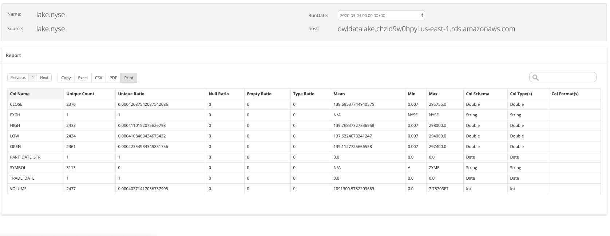

# Dataset Report

### Owl Dataset Report 

Search for a particular dataset and run to generate an exportable dataset profile report. Click on the report icon\* in the left navigation and choose Dataset report. Provide a valid dataset name in the auto-complete search box to see the report output.

