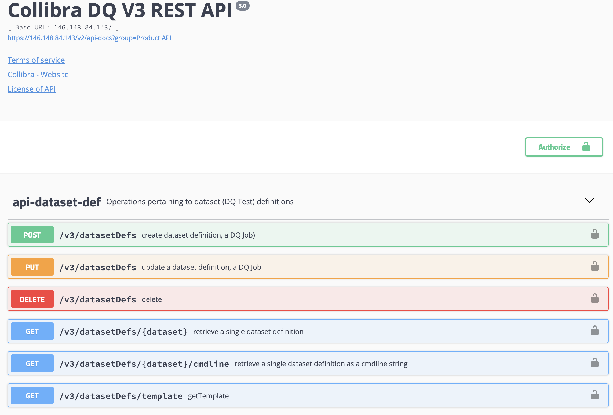
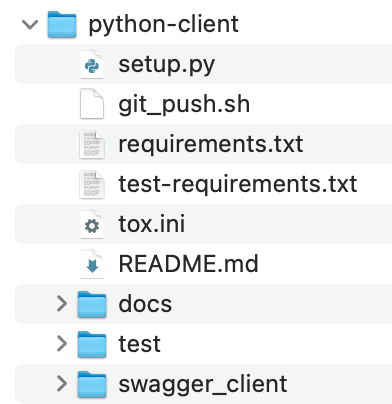

# APIs

All REST APIs are available inside the application under admin section.  The APIs can be used against the application in live working mode, which is preferred over documentation of APIs because it means the API works and was tested at compile time versus documentation time.

### Product API

The product API is for end-users who want to interact with the official and supported API.  You can also generate a client side SDK from the API with 4 steps below.



### Generate Client SDK

1. Go to [https://editor.swagger.io/](https://editor.swagger.io/)
2. Click File Import URL
3. Paste a URL that looks like this  [https://&lt;host&gt;/v2/api-docs?group=Product%20API](https://146.148.84.143/v2/api-docs?group=Product%20API)
4. Click generate client \(python, java, scala, C\#\)



### Internal API

Collibra DQ also exposes the internal API so that all potential operations are available.  The caveat is that these calls may change over time or expose underlying functionality.


### JWT Token For Auth

```text
import requests
import json
url = "http://localhost:9000/auth/signin"
payload = json.dumps({
  "username": "<user>",
  "password": "<pass>",
  "iss": "public"
})
headers = {
  'Content-Type': 'application/json'
}
response = requests.request("POST", url, headers=headers, data=payload)
print(response.text)
```

```text
curl --location --request POST 'http://localhost:9000/auth/signin' \
--header 'Content-Type: application/json' \
--data-raw '{
    "username": "<user>",
    "password": "<pass>",
    "iss": "public"
}'
```

