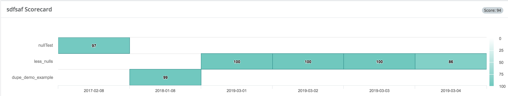

# Group Scorecard

### Visually and logically group datasets together to create a heat-map of blindspots.

Similarly to job control and build frameworks like Jenkins, we always want to know the health of our datasets.  Did it recently fail?  Does it commonly fail on Mondays?  What is the aggregate or composite score for a multiple datasets.  Owl handles complex scenarios such as datasets A, B and C should all be passing to have a valid nightly batch health check.  This protects the downstream process consumers from pulling erroneous data into their models. 

