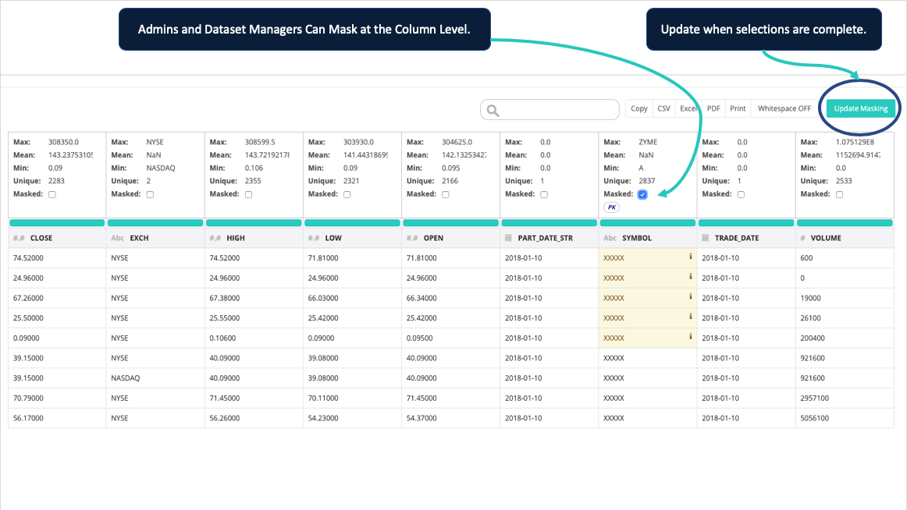

# Dataset Masking

## Masking From the UI

After an owlcheck has been run you can perform column level masking from the hoot page if you have ROLE\_ADMIN or ROLE\_DATASET\_MANAGER.


Masking updates will take effect for all existing and future runs of the selected dataset.



ROLE\_ADMIN and ROLE\_DATASET\_MANAGER also have the ability to unmask. 


