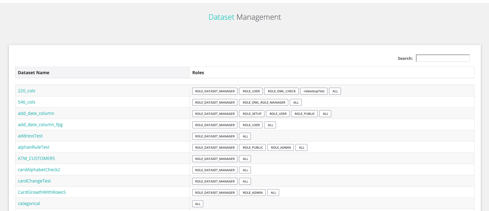
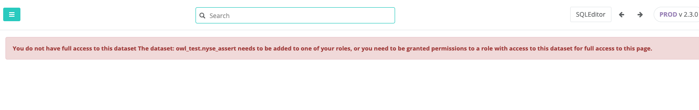

# Dataset Security

Log into the Admin Console Page as an Administrator of Owl.

Go to the Admin Console page \(click the Owl -&gt; click the Gear -&gt; click Admin Console\).

Click on “Security” as described in the “Security Settings” section of this document \(just above\) and toggle on “Dataset Security”.   

Log into the Admin Console Page as an Administrator of Owl.

Go to the Admin Console page \(click the Owl -&gt; click the Gear -&gt; click Admin Console\).

Click on “Datasets” as shown below

Note all the Datasets from the demo script we launch at the beginning of this document have been added to ROLE\_PUBLIC ROLE defined in Owl except the row\_count Dataset.  At this point we already have the [odemo@owl.com](mailto:odemo@owl.com) user created and mapped to the ROLE\_PUBLIC ROLE which has access to those Datasets.  Lets login as [odemo@owl.com](mailto:odemo@owl.com) and try to access row\_count DatasetStats page \(for an understanding on how to access the DatasetStats page see section entitled “Understanding the DQ DatasetStats Page” in this document…..doing so will result in the error message below.

However I can see the other DatasetStats that are part of the PUBLIC\_ROLE as [odemo@owl.com](mailto:odemo@owl.com) is a member of that ROLE.

The last thing to notice is that as the user [odemo@owl.com](mailto:odemo@owl.com) cannot access the Admin pages the AD Group odemo is a part of the ADMIN\_ROLE.

