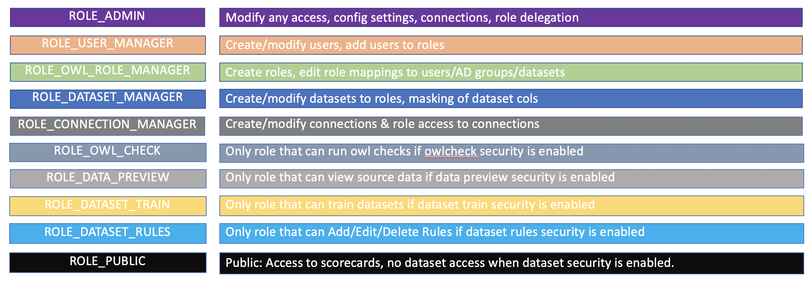

# Role Based Access Control \(RBAC\)

### RBAC Usages 

Owl supports RBAC configuration with both core roles and custom roles. Core roles include the following:

Custom roles can be added via the Role Management page by navigating to the Admin Console and clicking on the Roles Icon. Custom roles can also be added 'on the fly' during the Active Directory Role Mapping step.

It is these custom roles that will determine the users that have access to datasets \(including profile/rules/data preview/scoring\), and database connections

Additional information regarding setting up Dataset and Connection security can be found in those documents respectively.

