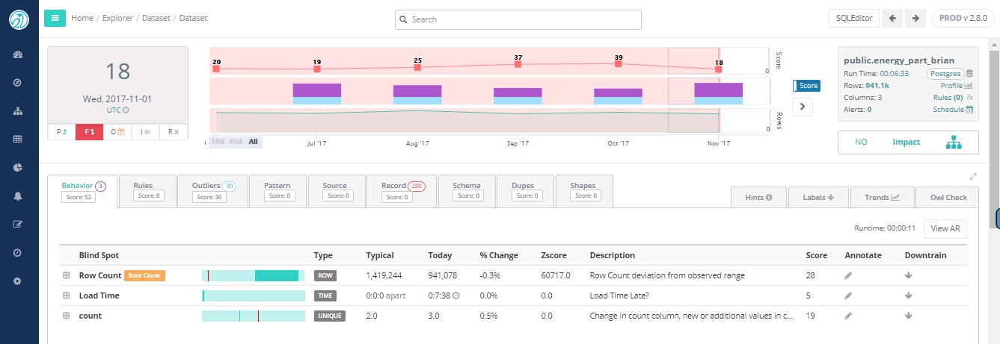

# Smart Meter Data

OwlDQ's Smart Meter Data Analytics provides accurate and predictable data quality to companies often inundated with massive amounts of data and aging enterprise systems.  

The U.S. smart meter data management market forecast is projected to reach $556.94 million by 2026. In 2018, U.S. electric utilities had about 86.8 million advanced \(smart\) metering installations. OwlDQ provides an automated process to manage the mountain of data collected, and glean critical business insights. By applying our ML algorithms during the normal data ingestion cycles Owl uncovered $10 million dollars in unbilled revenue for a leading US Energy Company.

In the example below, Owl  detected 200 records missing from the previous run.

Consider the following opportunities that smart meter data analytics provide:

* Generate new customer insights
* Manage and prevent outages
* Improve maintenance techniques
* Build predictive models for program planning
* Develop new services and rate plans based on customer requirements

Identification of unbilled revenue: Meter events and usage information can help illustrate a picture of the customer’s energy usage over time. This can help detect energy theft, meter tampering, and equipment issues that may be affecting service levels.

Outage event analysis and prevention: Today, some utilities are still unable to verify an outage unless personnel physically visit the suspected problem area to confirm. With outage event analysis, however, the utility can know the exact piece of equipment causing a problem, along with the customers directly impacted by it.

Meter quality assurance: Focusing on meter reading performance enables utilities to ensure reliability. When meter readings are expected but not delivered, the system provides an alert, and calculates overall data score from previous runs . Utilities are notified to potential data quality issues they never would have identified in the past.

It is meter data analytics that will enable utilities to tackle the problems of the future.

