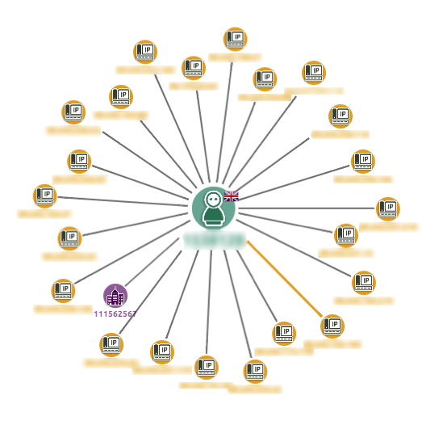
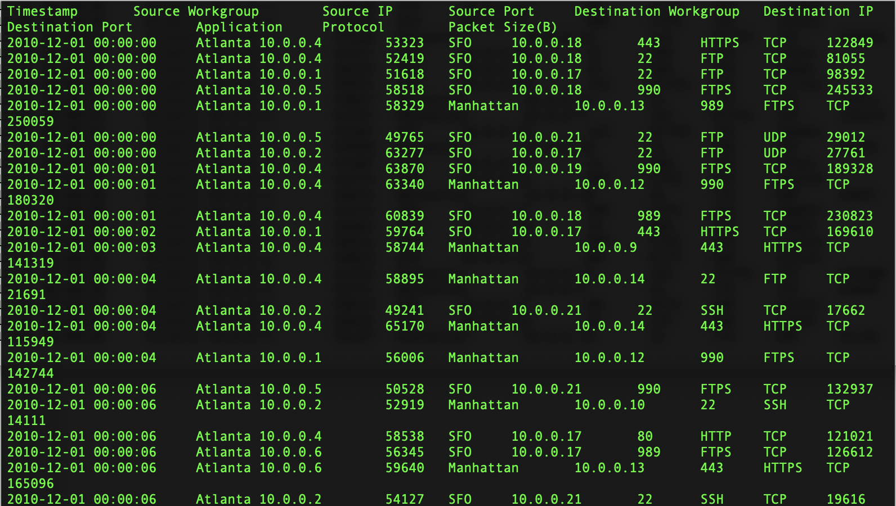

# Cyber Anomalies in Real-Time

With increasing number of cyber threats most of the cyber security team doesn’t have the capacity to manually detect, monitor, and defend against all. Effective cyber threat management requires leveraging automation to inform decisions. 

OwlDQ framework, provides organizations the ability to load and process diverse security data feeds at scale in order to detect network data anomalies. The OwlDQ alerts can enable network admins to respond to these events in timely manner.

Here we walk through a scenario to detect anomalies with network traffic dataset.  

1. IP address Validation
2. Detect the unusual network traffic patterns based on locations.
3. Identify the suspicious packets based on size.
4. Detect the malicious activity based on source and destination IP addresses.



## Infosec dataset Preview

Dataset contains Timestamp, Source Workgroup, Source IP, Source Port, Destination Workgroup, Destination IP, Destination Port, Application, Protocol and Packet size information.



##  IP Address format Validation

| Business Check | OwlDQ Feature |  |
| :--- | :--- | :--- |
| Is a valid formatted IP | RULE | AUTO-IP detection |
| Is the IP address NULL or Missing | BEHAVIOR | AUTO |

## Source and Destination Workgroups

| Business Check | OwlDQ Feature |  |
| :--- | :--- | :--- |
| Does it a usual network traffic based on locations | PATTERN | Source\_Workgroup -&gt; Destination\_Workgroup |

## Source and Destination IP Address validation

| Business Check | OwlDQ Feature |  |
| :--- | :--- | :--- |
| Does it a usual network traffic based on source and destination IP | PATTERN | Source\_IP -&gt; Destination\_IP |

## Packet Size

| Business Check | OwlDQ Feature |  |
| :--- | :--- | :--- |
| Is the Packet Size NULL or Missing | BEHAVIOR | AUTO |
| Packet Size within normal range | PATTERN | Source\_IP -&gt; Packet\_SizeB |


## Resulting OwlCheck

```text
-f file:///home/danielrice/owl/bin/demos/infosec/ -d tab \
-fullfile -fq "select * from dataset" -encoding UTF-8 -ds infosecv2 \
-rd "2020-04-04" -dl -dlinc Destination_IP,Packet_SizeB,Source_IP \
-dlkey Source_IP -fpgon -fpginc Destination_Workgroup -fpgkey Source_Workgroup \
-df "yyyy-MM-dd" -loglevel INFO -h 10.142.0.29:5432/owltrunk -owluser admin \
-fpgsupport .000000001 -fpgconfidence 0.4 
```

## Which components did we use?

OwlDQ address the issue of efficient network traffic classification by performing unsupervised anomaly detection and use this information to create dynamic rules that classify huge amounts of Infosec data in real time. 

By providing Infosec dataset along with anomaly records, OwlDQ  outlier and pattern algorithms found the anomaly in the network traffic. It mainly detect the following anomalies.

1. Traffic between Atlanta-&gt;Texas
2. The packet size extremely low between Atlanta-&gt;Texas
3. Atlanta source IP and Texas Destination IP. 

Realtime OwlDQ can provide the alerts on network traffic anomalies which can help network admins to do further deep analysis and take preventative measure which is daunting task with huge amount of data.

## Sample Dataset <a id="files-that-can-be-used-to-replicate-this-example"></a>




## 


