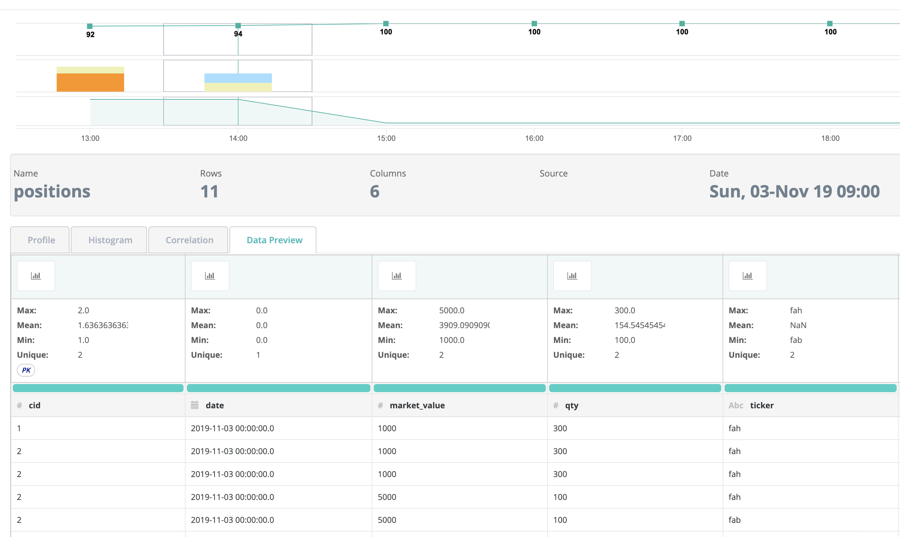

# Intraday Positions

It is common for financial organizations to receive a steady stream of files that have hourly or minutely data.  The files might trail the market in a near real-time fashion.  Below is an example

```text
--positions/
   |--2019/
     |--01/
       |--22/
         position_2019_01_22_09.csv
         position_2019_01_22_10.csv
         position_2019_01_22_11.csv
         position_2019_01_22_12.csv
```

### File Contents @ 9am

| TIME | COMPANY | TICK | SIDE | QTY |
| :--- | :--- | :--- | :--- | :--- |
| 2019-01-22 09:00 | T&G | xyz | LONG | 300 |
| 2019-01-22 09:00 | Fisher | abc | SHORT | 20 |
| 2019-01-22 09:00 | TradeServ | def | LONG | 120 |

### File Contents @ 10am

| TIME | COMPANY | TICK | SIDE | QTY |
| :--- | :--- | :--- | :--- | :--- |
| 2019-01-22 10:00 | T&G | xyz | LONG | 280 |
| 2019-01-22 10:00 | BlackTR | ghi | SHORT | 45 |

Notice that during the day you may or may not have a position for every company recorded.  We need a way to link the "company" to its position throughout the day but not alert in cases where they simply did not trade or adjust their position.  Owl offers real-time outlier detection for this scenario \(see code snippet below\).  We also need to make sure that each companies position is only represented once per file \(per hour in this case\) because positions are already the aggregate view of the trades, so they should be unique.  Owl offers duplicate detection \(see code snippet below\).

### Owl DQ Pipeline

```scala
// Part of your pipeline includes the ingestion of files that have the date
// and hour encoded in the file name. How do you process those files using Owl?
//
// Format: <name>_<year>_<month>_<day>.csv

val filePath = // <set this> positions/2019/01/22/positions_2019-01-22_09.csv

// Configure Owl.
val opt = new OwlOptions
opt.dataset = "positions"
opt.load.delimiter = ","
opt.load.fileQuery = "select * from dataset"
opt.load.filePath = file.getPath

opt.outlier.on = true
opt.outlier.key = Array("COMPANY")
opt.outlier.timeBin = TimeBin.HOUR

opt.dupe.on = true
opt.dupe.include = Array("COMPANY", "TICK")
opt.dupe.exactMatch = true

// Parse the filename to construct the run date (-rd) that will be passed
// to Owl.
val name = file.getName.split('.').head
val parts = name.split("_")
val date = parts.slice(2, 5).mkString("-")
val hour = parts.takeRight(1).head

// Must be in format 'yyyy-MM-dd' or 'yyyy-MM-dd HH:mm'.
val rd = s"${date} ${hour}"

// Tell Owl to process data
opt.runId = rd

// Create a DataFrame from the file.
val df = OwlUtils.load(opt.load.filePath, opt.load.delimiter, spark)

// Instantiate an OwlContext with the dataframe and our custom configuration.
val owl = OwlUtils.OwlContext(df, spark, opt)

// Make sure Owl has catalogued the dataset.
owl.register(opt)

// Let Owl do the rest!
owl.owlCheck
```

### Owl Web



### DQ Coverage for Position data

* Schema Evolution
* Profiling
* Correlation Analysis
* Segmentation
* Outlier Detection
* Duplicate Detection
* Pattern Mining

