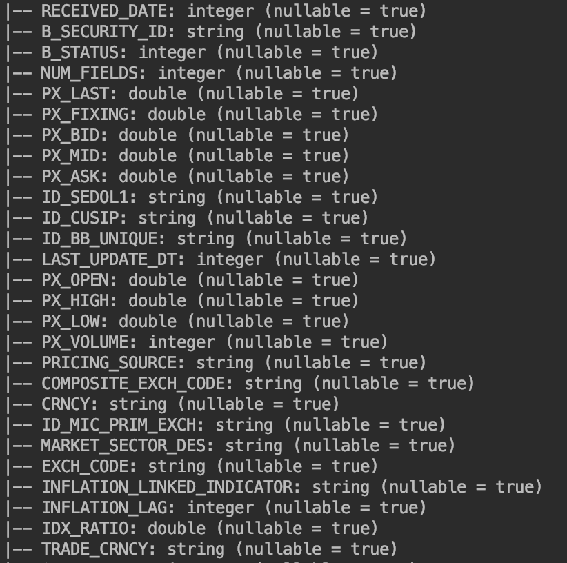
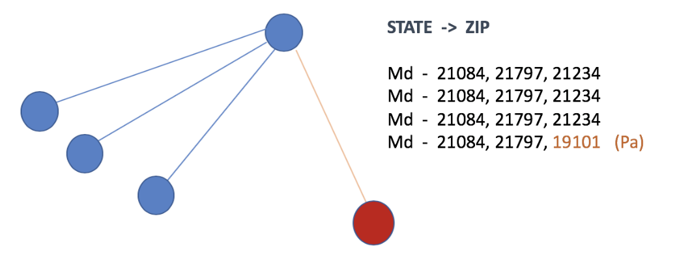

# Security Reference Data

Given the interconnected, automated nature of the data generated by reporting, exchanges, and source systems -  hidden patterns go unnoticed. 

Financial firms of all shapes and sizes ingest financial data for a variety of reasons. A few vendors include Bloomberg, Thomson Reuters, ICE Data Services or SIX Financial Information.

 **In no uncertain terms, critical business decisions rely on the accuracy of this data.**

This data is not monolithic and most real-world data easily consists of over 100 columns. Maintaining the quality can be challenging, given the variety of sources feeding into just a single feed. Even the most simple quality checks can snowball into a daunting task. Everything from tickers, sedols, cusips, products, sub-products, issuers, and issuing countries can further complicate the problem. Identifying anomaly values earlier in the data ingestion process can significantly reduce downstream complexity. Furthermore, finding improbable patterns before they're used for making decisions can save costly remediation efforts.

### An easy way to think about Pattern Analysis. Columns that belong 'together'. 

A common application of OwlDQ is to identify securities that are violating historical patterns. Conditional dependencies can be discovered and used as a guide to highlight misreporting. Rather than defining look-up tables, reference datasets, and predefining exact conditions - security specific patterns can be derived using probabilistic inferences.

By clicking columns that belong together, a robust framework for cross-column pattern analysis can be generated. The equivalent of dozens of multi-column, conditional rule checks can be applied with just a few clicks. In creating a confidence and probability weighted classification algorithm, this is both adaptive and granular.

Using this technique, OwlDQ is able to reduce false positives, scale coverage, and quickly model a more complex series of checks than domain experts would want to develop.

